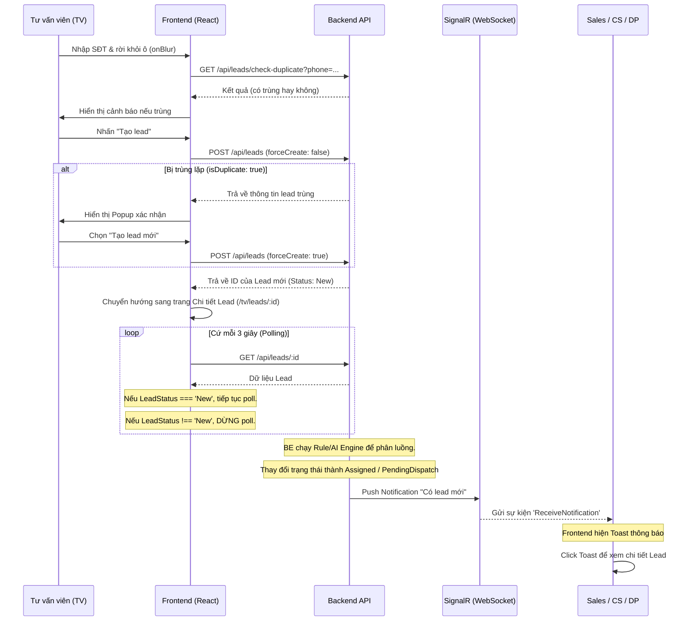

# 🌊 Frontend Logic — Luồng Tạo Lead & Phân Luồng Tự Động (Main Flow)

Tài liệu này mô tả chi tiết logic xử lý trên Frontend cho luồng nghiệp vụ cốt lõi của OmniRoute: **Từ khi Tư vấn viên (TV) tạo một Lead mới, cho đến khi Lead được AI/Rule engine phân luồng và thông báo đến người nhận.**

---

## 📍 Sơ Đồ Luồng Tổng Quan (Frontend Perspective)



---

## 🛠️ Chi Tiết Triển Khai Logic

### 1. Xử lý nhập liệu và Kiểm tra trùng lặp (Duplicate Check)

File liên quan: `src/pages/tv/LeadsListPage/LeadsListPage.tsx`

**Logic:**
- Khi user đang gõ SĐT, hàm kiểm tra chưa chạy ngay để tránh gọi API liên tục.
- Sử dụng sự kiện `onBlur` (khi user click ra ngoài ô SĐT), Frontend sẽ kích hoạt một hàm **debounce** (500ms) để gọi API kiểm tra: `checkDuplicate(phone)`.
- Nếu Backend trả về `hasDuplicate: true`, UI sẽ hiển thị một banner cảnh báo màu vàng ngay dưới ô SĐT, kèm theo link để TV có thể click vào xem chi tiết Lead cũ đó ngay lập tức.

### 2. Gửi Yêu Cầu Tạo Lead (Submit)

File liên quan: `src/pages/tv/LeadsListPage/LeadsListPage.tsx` và `src/features/tv/hooks/useLeads.ts`

**Logic:**
- Khi click "Tạo lead", FE gọi `useCreateLead` mutation gửi request `CreateLeadRequest` với cờ `forceCreate = false`.
- **Trường hợp Backend phát hiện trùng lặp cứng:** API có thể trả về một response đặc biệt báo `isDuplicate = true`.
- Frontend bắt được response này sẽ **không** chuyển trang ngay. Thay vào đó, một **Dialog Xác Nhận (Confirmation Modal)** sẽ hiện lên (cảnh báo: "SĐT này đã tồn tại lead... Bạn muốn xem lead cũ hay tạo lead mới?").
- Nếu TV chọn "Tạo lead mới", FE gọi lại API lần 2, đính kèm `forceCreate: true`. Backend sẽ bỏ qua bước check duplicate và tạo lead.
- Sau khi tạo thành công (lấy được `leadId`), FE gọi hàm `navigate('/tv/leads/' + leadId)` để sang màn hình chi tiết.

### 3. Cơ Chế Polling Đợi Phân Luồng (Smart Polling)

File liên quan: `src/features/tv/hooks/useLeads.ts` (Hook `useLeadDetail`)

**Vấn đề:** 
Hệ thống sử dụng AI và Rules để phân luồng, quá trình này ở Backend chạy bất đồng bộ (Background job) và có thể mất từ vài trăm mili-giây đến vài giây. Khi Frontend vừa tạo xong, Lead ở trạng thái `New` (chưa có người nhận).

**Giải pháp (Frontend Polling):**
Frontend dùng tính năng `refetchInterval` của React Query để chủ động hỏi lại Backend.

```typescript
export function useLeadDetail(id: string, pollWhileNew = false) {
  return useQuery({
    queryKey: leadKeys.detail(id),
    queryFn: () => leadService.getLeadById(id),
    enabled: !!id,
    // Poll mỗi 3s nếu trạng thái vẫn là 'New' (Engine đang chạy)
    refetchInterval: (query) => {
      if (!pollWhileNew) return false;
      const data = query.state.data;
      return data?.leadStatus === 'New' ? 3000 : false; 
    },
  });
}
```

- **Khi TV vào trang chi tiết vừa tạo:** Hook được gọi với `pollWhileNew = true`. 
- **Cách hoạt động:** Cứ 3 giây gọi API 1 lần. 
- **Điều kiện dừng:** Ngay khi API trả về trạng thái khác `New` (ví dụ `Assigned` - đã phân công tự động thành công, hoặc `PendingDispatch` - không phân công được cần người xử lý), hàm trả về `false` và tiến trình polling tự động dừng lại. Lúc này, UI cập nhật hiển thị "Người được gán" và "Thời gian SLA".

### 4. Phân Luồng Thành Công & Thông Báo Real-time (SignalR)

File liên quan: `src/features/notifications/hooks/useSignalR.ts`

**Logic:**
- Khi Backend phân luồng xong, lead chuyển trạng thái `Assigned`. Backend tự động push một message qua WebSocket (SignalR) đến client của nhân viên (SA/SS/CS/DP) vừa được nhận lead.
- Hook `useSignalR` (chạy ngầm ở mọi trang khi user đã login) lắng nghe sự kiện `ReceiveNotification`.
- **Khi nhận được sự kiện:**
  1. Gọi `prependNotification()` vào Zustand store để cập nhật danh sách thông báo trên chuông.
  2. Gọi `incrementUnread()` để tăng số đếm báo đỏ.
  3. Bắn một Toast notification (bằng thư viện `sonner`) ở góc màn hình.
- Toast này có một nút "Xem". Hàm `getNotificationRoute` sẽ tính toán URL đích dựa theo `roleName` của user hiện tại và loại Entity (`LEAD` hoặc `TICKET`).
  - Ví dụ: User là `SA` -> URL là `/sa/leads/:id`.

### 5. Tiếp Nhận và Xử Lý

- Nhân viên SA (hoặc DP) click vào thông báo, Frontend chuyển hướng đến trang chi tiết Lead tương ứng.
- SA tiến hành tư vấn, gọi điện. Mọi thay đổi trạng thái sau đó (ví dụ từ `Assigned` -> `Contacted`) đều qua API update lead thông thường và cập nhật thẳng vào UI.

---

## 🛡️ Điểm Đáng Chú Ý Về UX/UI

1. **Không chặn thao tác:** Quá trình Polling chạy ngầm dưới nền. TV vẫn có thể xem được thông tin Lead (tên, sđt, nhu cầu) ngay lập tức dù chưa biết sẽ phân cho ai.
2. **Real-time êm ái:** Việc báo thông báo dùng SignalR kết hợp Toast giúp nhân viên sale nhận lead "nóng" ngay lập tức mà không cần F5 trình duyệt.
3. **Phòng chống Rác Dữ Liệu:** Cơ chế check duplicate 2 bước (lúc gõ SĐT và lúc ấn Submit) bằng Frontend Logic giúp giảm thiểu tối đa việc tạo trùng Lead do vô ý.
